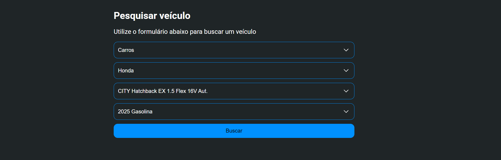
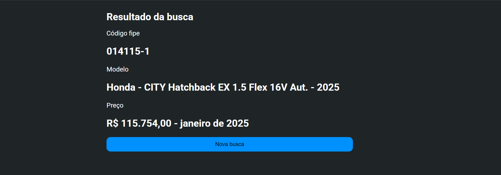

# FSD - Fipe
This project uses [Feature Sliced Design](https://feature-sliced.design/) to build a simple Webapp that fetchs data from [Fipe API HTTP Rest](https://deividfortuna.github.io/fipe/), filtered by user and display the price of common vehicles in Brazil.

Live demo: https://matheusmoura17.github.io/fsd-fipe

Search Form

Search Result

## Stack
- React
- Typescript
- Tanstack
- Zustand

## Development
Install dependencies using `yarn`, and run project using `yarn dev`